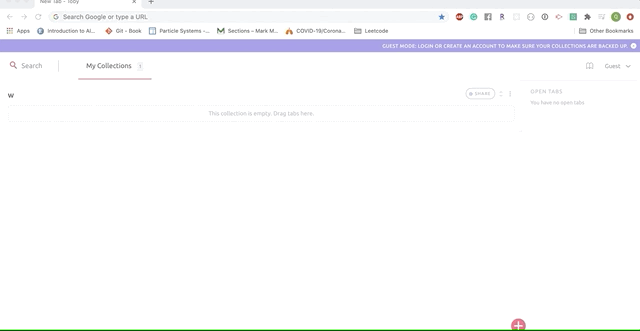
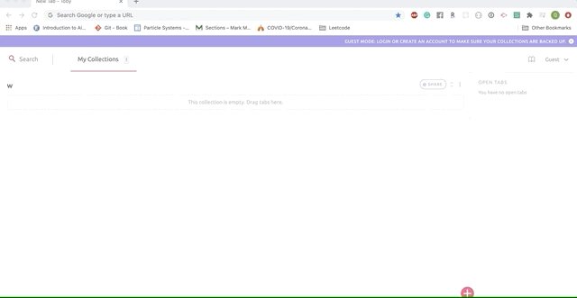
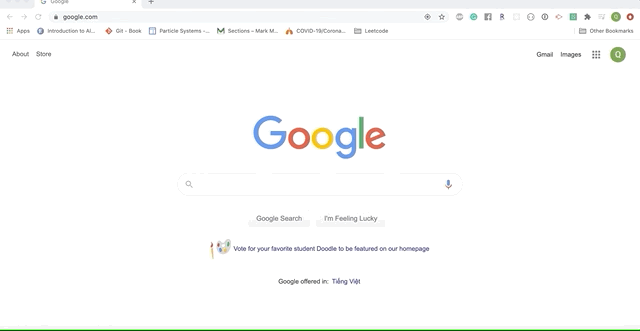
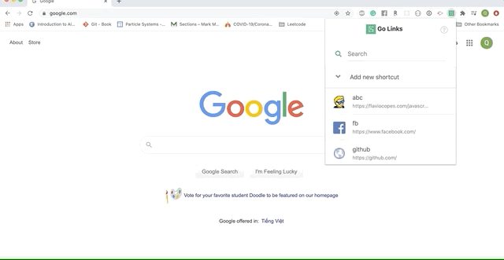
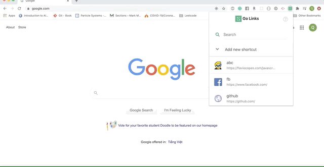

# Go Links
A browser extension for creating personal URL shortcuts. Available on Chrome and Firefox.

## Installation

### Chrome / Brave

https://chrome.google.com/webstore/detail/go-links/gojgbkejhelijlkgpmlbbkklljgmfljj?h1=en

## User Guide to Go Links

    
How to create a golink?

1. Go to the website you want to create the shortcut for.
2. Open Go Links.
3. Expand "Add new shortcut"
4. Fill in a name for your shortcut.
5. Click "Save" button.

You will then be able to access the same url using that shortcut. See `How to access a website`for instructions.

    
How to access a website?

#### Access via shortcut
1. Type `go/<your-shortcut>` in current tab or in a new tab.
2. You will be redirected to the website linked to that shortcut.

#### Access via extension popup
1. Open Go Links.
2. Click on the shortcut entry.
3. The website will be opened in a new tab.

    
How to search for a golink?

1. Open Go Links.
2. Click on the search box.
3. Type in your search query.
4. Your search results will be filtered in ascending order.

    
How to delete a golink?

1. Open Go Links.
2. Move your mouse on the entry that you want to delete. The trash icon will appear on hover.
3. Click on the trash icon.
4. Confirm your selection.

    
How to overwrite a golink?

1. Go to the new website for which you want to use the shortcut.
2. Open Go Links.
3. Expand "Add new shortcut".
4. Type in the shortcut you want to overwrite.
5. Click "Overwrite" button.

